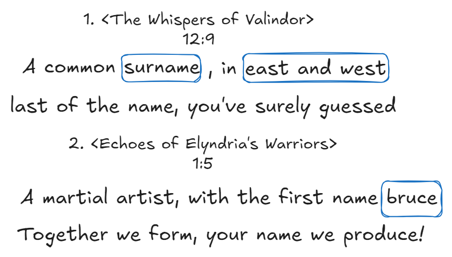
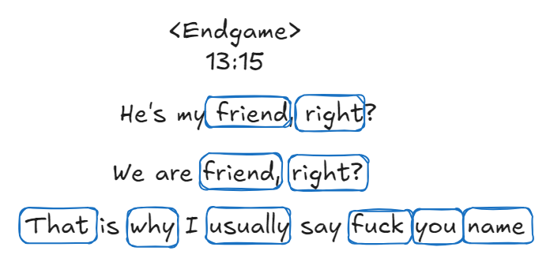

# Solutions

## The whole idea

Hiiiii my darlinggggg 💕! Sorrrry for being late, we Elves are revealing the solutions to ur second journey! The first two hints might not directly point to ur angel 🕊️, but guess what? The third one does! 🌟✨ Let’s dive in together and see how they all connect! 🔍🤩

## [welcome-to-rivendell.md](welcome-to-rivendell.md "mention")

The first challenge is a **"riddle"** 🤔, and to solve it, you’ll need to use the **Tengwar to English Translation Table** ✍️🔠. Simply "substitute" the characters, and voilà—the original paragraph will reveal itself! ✨📜

<figure><picture><source srcset="../.gitbook/assets/hint1-answer-dark.png" media="(prefers-color-scheme: dark)"></picture><figcaption></figcaption></figure>

Now, this should be pretty easy, right? 🤔✨ My darlingggg 💕! The answer is: **Lee**. This is one syllable of a very important person’s name (but not ur angel 🕊️). 🌟🔍

## [the-elves-mahjong-curiosity.md](the-elves-mahjong-curiosity.md "mention")

Hahaha, this challenge should be a piece of cake for you, my darlingggg 💕, right? 😄✨ The three magic numbers are **1, 3, and 4**. Since they might contain location information, and by now, ur angel 🕊️ must be a guy, we can list out all possibilities. The final answer? **413**, which points directly to **C413**—where that important person might live! 🏠🔍

But wait, there’s more! One extra piece of information can help you verify this! 🌟 Let’s break it down together: the two biggest numbers, **4** and **3**, multiply to give **12**. Then, add the smallest number, **1**, to the MSB of 12 (which is **1**), and you’ll still have **12**. As the hint suggests, this number is something everyone has and something that changes everyone—it’s the **age** of that important person to your angel! 🎂🔢✨

## [the-endgame.md](the-endgame.md "mention")

Now, my darlingggg 💕, you might have realized that you’ve got a name—**Mr. Bradley**! 🌟✨ But wait, he might not be your angel 🕊️ just yet! And now, the **third hint** is here, meant to be the most challenging one 🔥🔍! To crack it, you’ll need to follow **two steps**:

1. Use the **Tengwar to English** table to decode the Sindarin words into modern English letters ✍️🔠.
2. Then, use the **"dictionary"** to translate the Sindarin words into real, modern English 🌟📖.

And when you’ve done that, the final answer will look something like this:

<figure><picture><source srcset="../.gitbook/assets/hint3-answer-dark.png" media="(prefers-color-scheme: dark)"></picture><figcaption></figcaption></figure>

Now, we’re super close to the right answer! ✨ The "I" in the clue is none other than **your angel** 🕊️! And the "name" is **Mr. Bradley**, one of your angel’s closest friends from **THOC**! 💬🤝 This friend has a _unique_ habit of saying **"Fuck you"**, which is a very, very bad word 🙈💥. Sometimes, your angel has no choice but to say it back to him—HAHAHA! 🤣✨

Let’s see if you can piece it all together, my darling! 💕🔮 And then, if you ask some **Cbling** 🤔✨, I think you’re very likely to get the final answer to who your angel 🕊️ truly is! 🌟💕

***

At last, sorrreeee my darlingggg 💕 for misleading you at the beginning 😔✨. We promise to make your hints more straightforward if we ever get another chance next time! 🌟🔍💖
