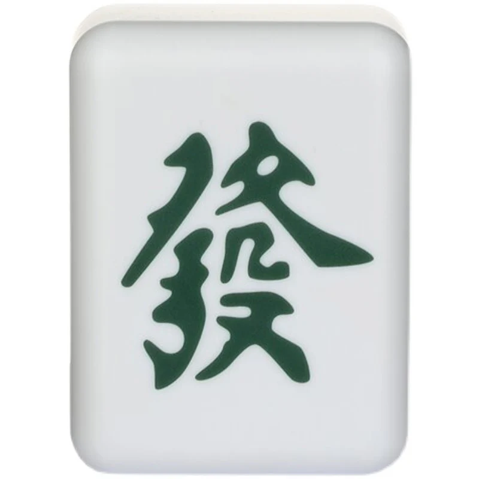

# 🀄️🧝‍♂️The Elves' Mahjong Curiosity 🧝‍♂️🀄️

## Background

My darrrlingggg 🌟, while searching for the second hint for your angel 😇, we, the elves 🧝‍♀️🧝‍♂️, stumbled upon an ancient game from the distant East—Mahjong 🀄️! According to our ancestors' records 📜, this game requires incredible mathematical skill 🧠💡 and sharp logical thinking 🧩✨. We were instantly fascinated by it 😍, but alas, we struggled to understand its intricate rules 🤯. Fortunately, our memory is excellent 🧠📚, and we recalled you once mentioning that you're a Mahjong expert 🀄️💪💖! So, we decided to ask you a few questions about the game, hoping your expertise will guide us in mastering this mysterious Eastern art 🌏🀄️🔍.

## Our questions

Dear darlinggg Gwen 💖✨,

We remember you mentioned that you’re an expert at this ancient game from the distant East—Mahjong 🀄️! We are incredibly fascinated by this game, but as we delved into its rules 📜, we found ourselves with a few questions 🤔. Would you be so kind as to help us unravel these mysteries? In return, we promise to provide you with more hints about your angel 🌟.

Thank you, our brilliant and wonderful darlinggg!!! 🌈💫

1. **We think the “Fa” tile looks really beautiful! 🌸 But in a complete Mahjong set, how many “Fa” tiles are there?** 🀄️❓

<figure><figcaption>
"Fa"
</figcaption></figure>

2. **We’ve heard that you enjoy Mahjong and came across “1q3” in your games. 🌟 But what does “1q3” mean?** 🃏💭

We are eager to learn more about this fascinating game from you, my darlingggg! 🌈💖✨

## The Seconddd Hintttt

Thank youuu, darlingggg 💖✨, for teaching us about **Mahjong**! 🀄️🌟 In return for your kindness, we’d like to share more information about **ur angel**! 😇💖

Ohhh darlinggg 🌸✨, pay close attention to the numberssss 🔢 hidden in the two questions 🧐📜!! They hold the secrets we’ve uncovered from the ancient booook 📖💫, where the second hinttt lies... 💡🔮 Let your sharp eyes 👁️👁️ find what we elves 🌿🧝 have found!! Good luck, darlinggg 😘🌟

> Ohhh how magical are these **three** numberrrssssss! ✨🔢 They not only conceal the mystery location 🏞️🌙, but also reveal yet another secret 🔮🌟. Follow the rule handed down through the ages 📜🧝‍♀️:
>
> 1. multiply the biggest twoooo numbers ✨🔢✨,&#x20;
> 2. then add the smallest 💫 to the most significant **bit** of what you get in step 1🔢➕💡.
>
> This new numberrr 🧮, which everyone possesses 🌍✨, changes every year 📅🔄 and holds the secret key 🗝️🔮 to help you verify if you've truly found the "right" person 🧙‍♀️💖. Let it guide you on your journey, darlinggg 💫🌟!
