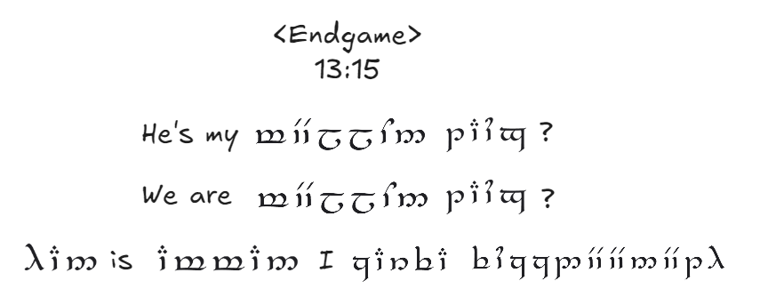
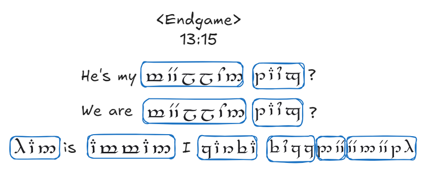

# ✨🎮The Endgame 🎮✨

My dearest darlinggggg 💕, this is the **final** clue 🔍 we can offer about ur angel 🕊️, and it’s tied to the first two hints 🔗. We’ve searched through all of our ancient tomes 📚✨, turned every dusty page 📜, and consulted the wisest of elves 🧝‍♂️🧝‍♀️. This clue comes from the oldest book in our possession 📖, a sacred text dating all the way back to the **first century** 🏛️⏳. The wisdom it holds is ancient and powerful 🌟, and this is the **last hint** hidden in those fragile, timeworn pages 💫.

However, since this book was written in an **ancient elvish script** (not Sindarin) 🧝‍♂️📜, we have done our utmost to translate the information into English, but there are still some difficult words for them and we can only provide them in **Tengwar** script written in **Sindarin** ✍️🔠.

## Final Hint

The original text from the ancient book is truly difficult to understand 😣📜! Its cryptic language and complex phrases are a puzzle of their own 🧩🤯. Even after all our efforts to translate it, the meanings remain shrouded in mystery 🔮✨. We’ve done our best, but some parts might still leave you scratching your head 🤔🤷‍♀️

<figure><figcaption>
The final hint - original
</figcaption></figure>

Here is the message we’ve managed to unveil for you:

<figure><figcaption>
The final hint - Translation
</figcaption></figure>

But wait! 🛑 In this _fragmented_ quote 🧩, who is "he" 🕵️‍♂️? And who is the one saying it 🎙️? Ahhhhh. This word  , is it just English written in Tengwar, we don't knowwww😱. And is this what we get from the first two hints? It's soooo hard, we feel like we've stumbled into an ancient curse 🧙‍♂️💀, ahhhhhh 😵‍💫! We can't tell you any more! 🔒 This is all the wisdom we can share 🌌.

## Notes from ur elves 📜

My darlinggggg 💖✨, the circled words 🔵 are written in **Tengwar** using our beautiful language—**Sindarin**! 🧝‍♀️🌿 We sincerely tried our best to translate them, but these English words proved to be quite challenging for us! 😅📚

However, we’ve also found some helpful [dictionaries](https://www.elfdict.com/) 📖🔍 that explain how to convert **Sindarin** to English! Here’s what you need to do:

1. **Set your search settings** to **Sindarin** 🌐. (And do not click "Reverse" or "Incl. outdated")

<figure><figcaption>
Dictionary Searh Settings
</figcaption></figure>

2. Remember, **Sindarin** also uses letters from English! 🅰️🅱️ So, my darlinggg, all you need to do is use the table from (**Hint 1** 🔑 [#the-language-barrier](welcome-to-rivendell.md#the-language-barrier "mention"), and the same rule that applies in hint 1 also applies here) to get the English letters from the **Sindarin** words written in **Tengwar**.
3. Once you have those letters, form a "strange" English word 🧩🤔.
4. Finally, use the dictionary 📖🔍 to search for what this **Sindarin** word means in English!
