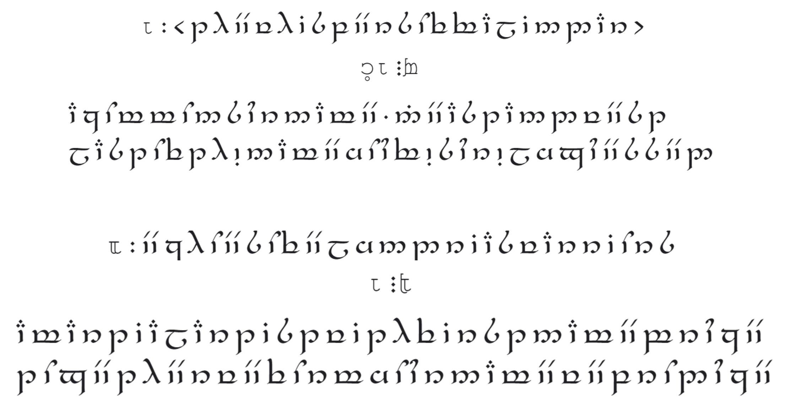
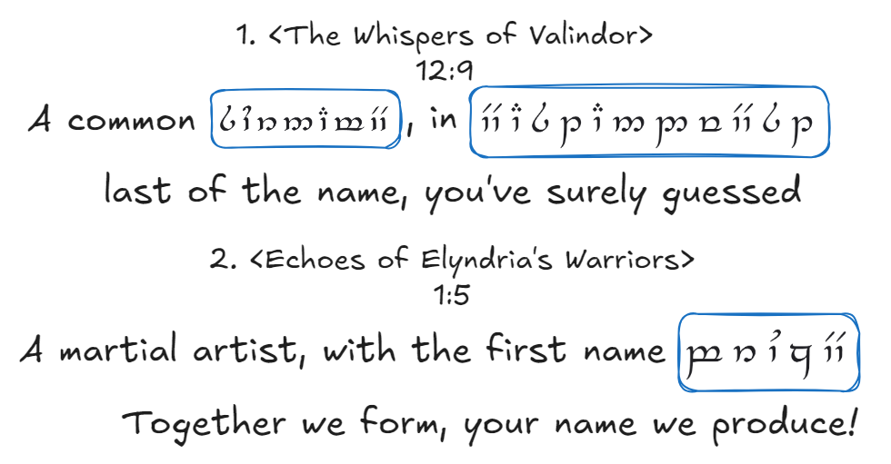
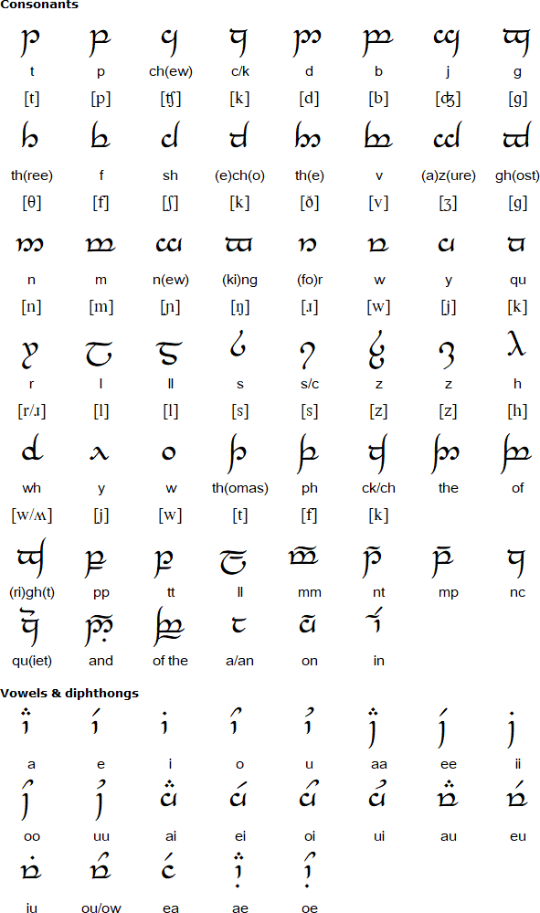
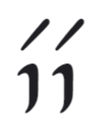

# 🌄Welcome to Rivendell 🌄

## Welcommme to Rivendell!!!

Welcome to the first hint, darling! 💖🌟 We 🧝‍♂️🧝‍♀️, in our endless gratitude, have decided to lead you on a **magical adventure** ✨ to our breathtaking homeland, **Rivendell** 🏞🌿. There, in the heart ❤️ of our ancient city 🏛, they’ve gathered books 📚 that have been carefully preserved since the **First Age** 🕰. These ancient tomes hold precious information about a piece of **ur angel’s** name! 😇💫

## Elves' sacred text:

Dear darlinggg Gwen 💖✨,

After much searching 🧐, we uncovered the following clue hidden within their sacred texts 📜✨:

<figure><figcaption>
Original Version
</figcaption></figure>

## Notes from ur elves 📜

### **The Elves' Riddles** 🧝‍♀️🧩

Dearest darling, the words before you are not mere mortal writings ✍️. No, these sacred texts date back to the legendary **First Age** 🕰, a time when we elves had an irresistible love 💖 for riddles and puzzles 🧩. What you see is a carefully woven riddle, a magical key 🔑 that will guide you to uncover part of **ur angel’s** name (This name is the one the others usually used to call your angel 😇, not his surname! 📝💖) 🧠🔍. Let your mind dance with the mystery, as only you can unravel its secrets! 🌟💫

### **The Language Barrier** 🌐🧝‍♂️

Ah, these ancient tomes 📚 were penned in our graceful tongue, [**Sindarin**](#user-content-fn-1)[^1] 🧝‍♂️🗣, a language of beauty and elegance 🌿 and using [**Tengwar**](#user-content-fn-2)[^2] to write. Though we have humbly attempted to bring these words into your familiar English 🗣, we confess, our grasp is not flawless 😅. There may be subtle twists and turns that challenge you. But we know your brilliance will shine through! 💖✨

***

But fret not, my beloved darlingggg 💕💖! The **kind-hearted elves** 🧝‍♂️🧝‍♀️ have worked their magic ✨ and translated the mysterious **Sindarin** language 🧝‍♂️🌿 into **English** 🗣. However, even with all their wisdom, they couldn’t quite manage to translate everything perfectly from **Tengwar** 🔠 to modern English letters ✍️.

<figure><figcaption>
Translated Version
</figcaption></figure>

But don’t worry! They’ve uncovered a **special table** 📜 from their books that shows the exact **rules** for doing just that! 🧩✨

<figure><figcaption></figcaption></figure>

**For example**,   is "**ee"** and it represents **"e"** in English,  is "**t**" in English,  is "**r**" in English.


&#x20;Be patient my darlingggg, take this time to enjoy our beautiful language!😘💖😘💖


Sooo, my darlingggg 💖✨, here’s what you need to do! 🌟

1. Use the **Tengwar to English conversion table** (the image above) 📜🔠 to uncover the **hidden English words** 🗣✨ nestled within the elves’ sacred text 📚.
2. Then unravel the mystery 🔍 and find the **three-letter long answer**🧩 to these two enchanting riddles! 🕵️‍♀️💫

With this guide, you’re sure to succeed! 💫 Good luck, my **smartest** darlingggg 😘💖! You’ve got this! 🌟


Keep your first hint safe, my darlinggg 💕🤫, because this may be a special part of **his nameeeee** though it **may not match every letter exactly the same**✨🕵️‍♀️🔑 Shhh, let it be a delightful surprise! 🎉🌟 You’re doing amazing, and we can’t wait to see what you uncover! 💖💫🤗


[^1]: Sindarin is an Elvish language created by J.R.R. Tolkien, spoken by the Grey Elves in Middle-earth. It evolved into the everyday language of Elves by the Third Age, featuring Welsh-like sounds and a flowing phonology.

[^2]: Tengwar is a script created by J.R.R. Tolkien, primarily used to write the languages of Middle-earth, such as Quenya and Sindarin. The elegant, flowing letters are designed to represent both vowels and consonants in various languages. Each character, or tengwa, is adaptable, allowing for different modes depending on the language being transcribed. While originally created for Elvish languages, Tengwar can also be used to write English and other tongues with specific modifications.
