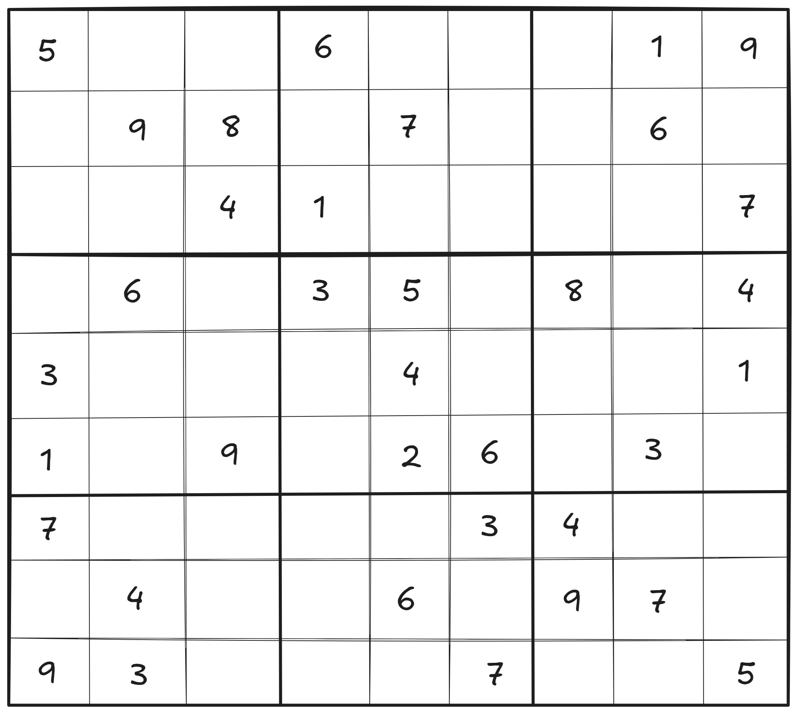
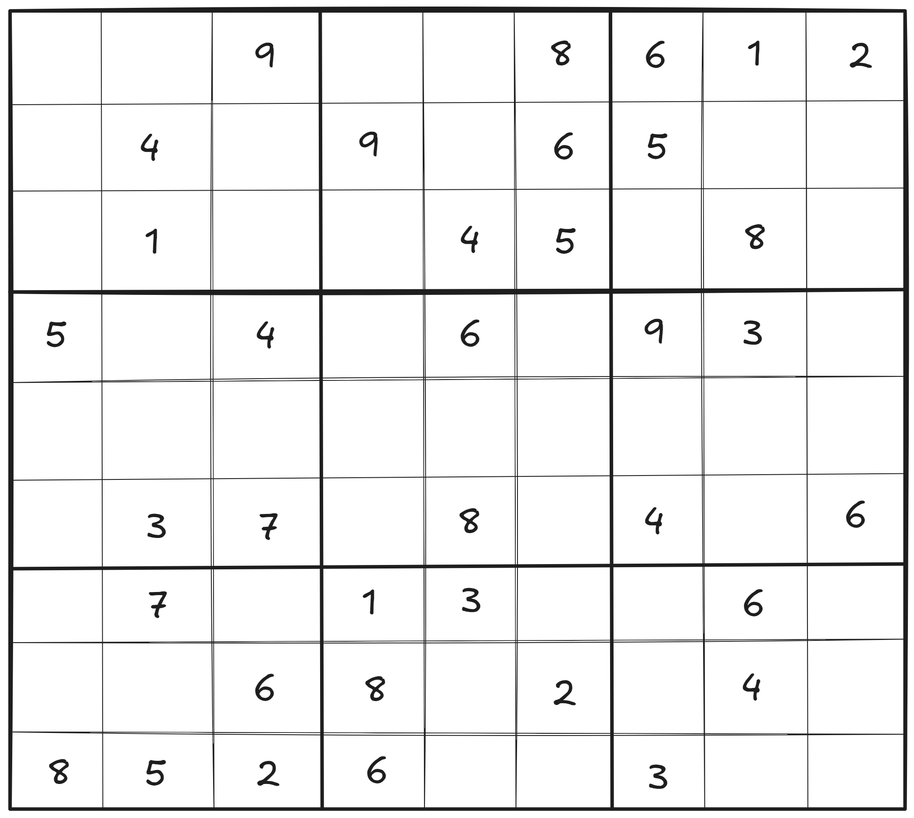
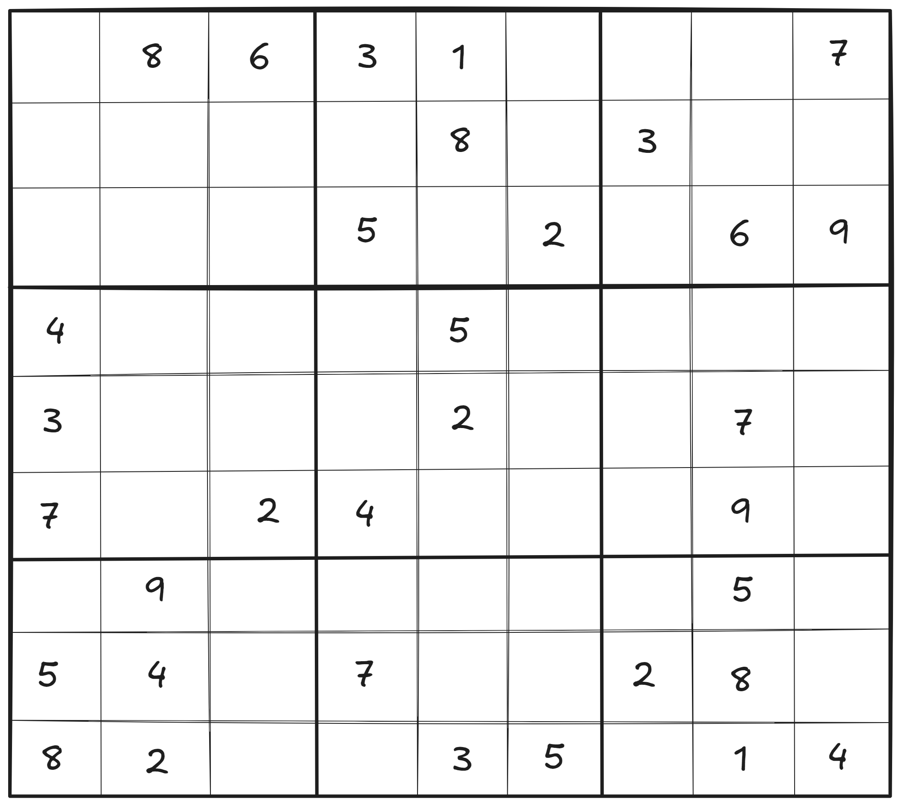
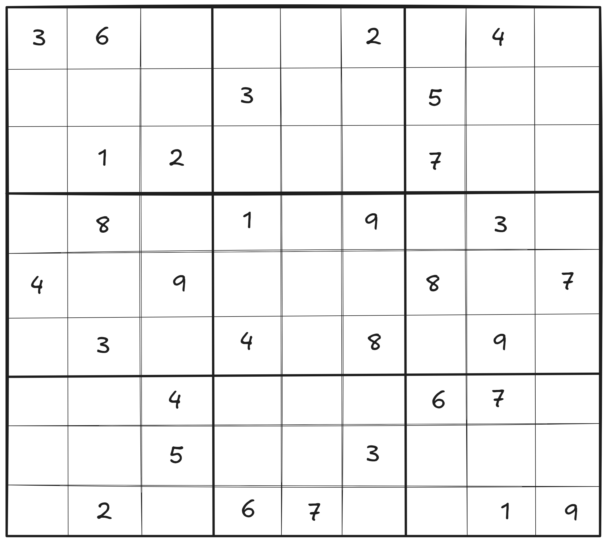
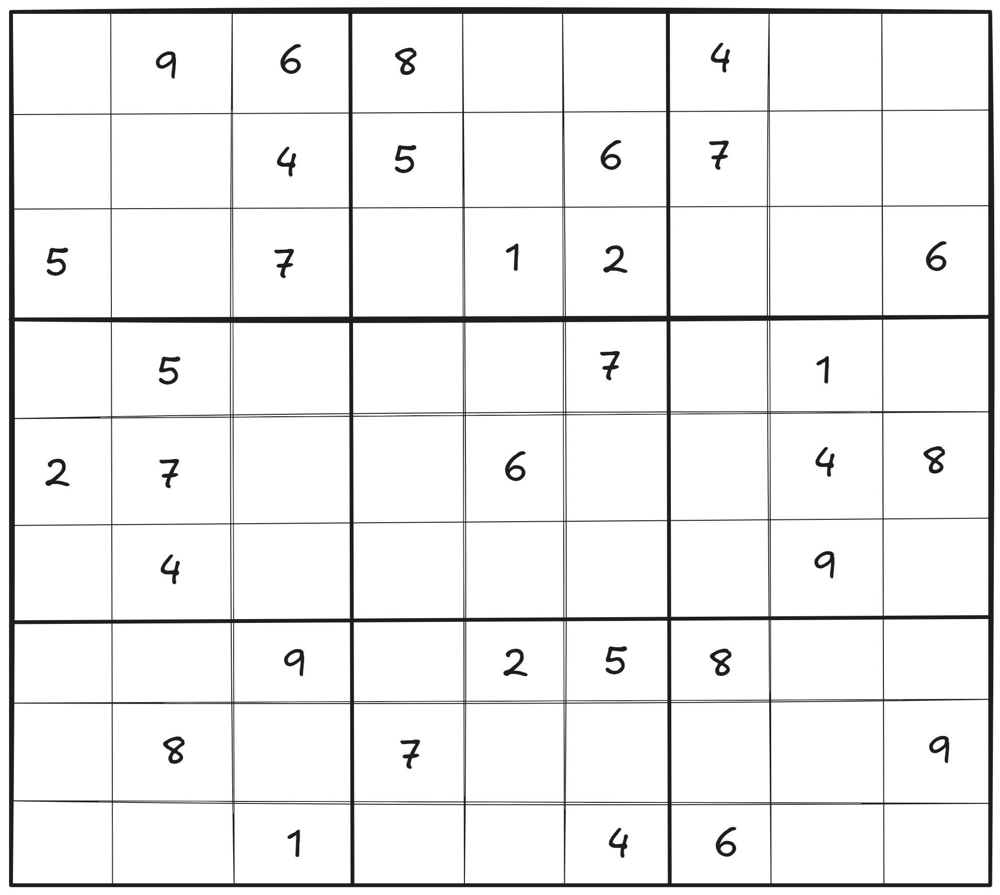
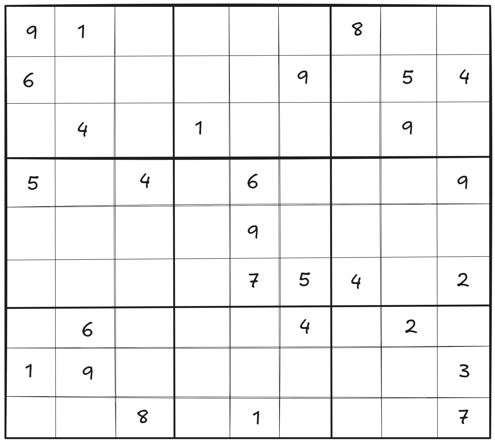
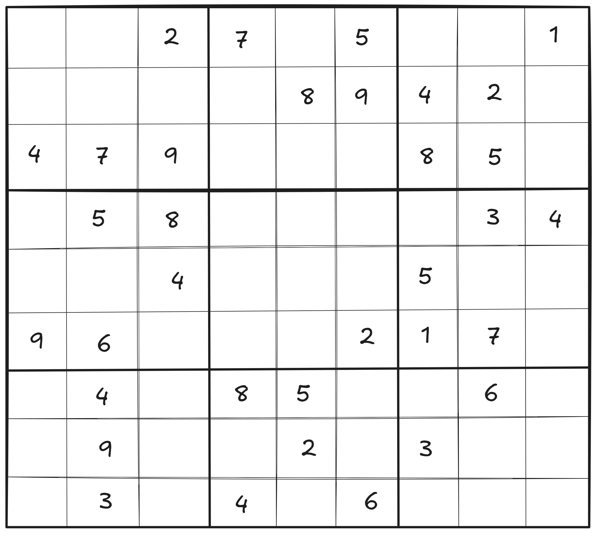
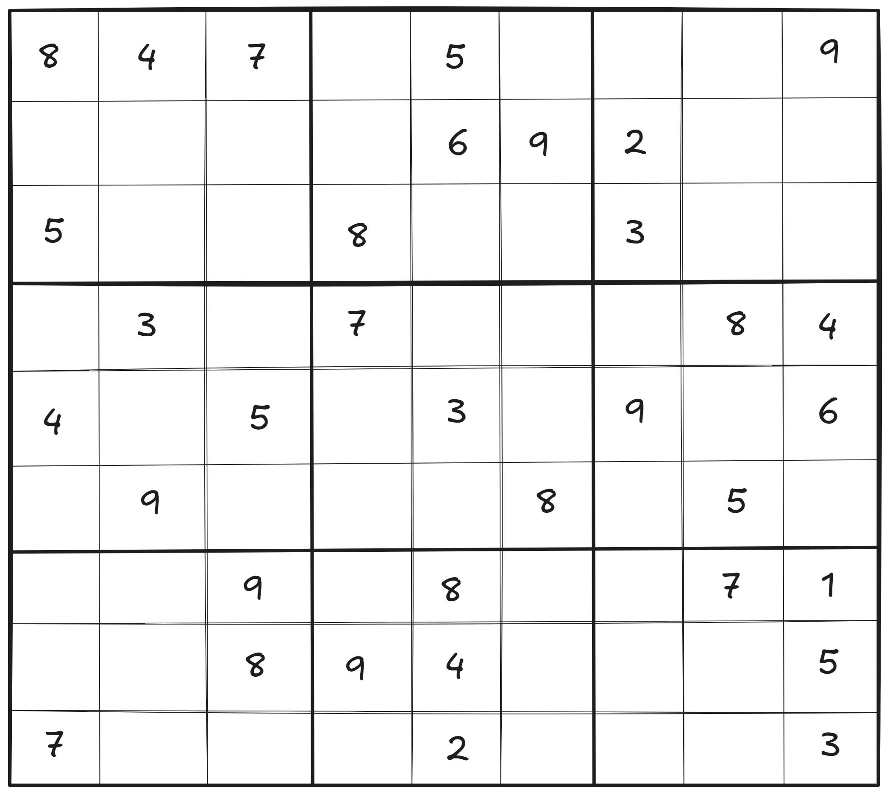
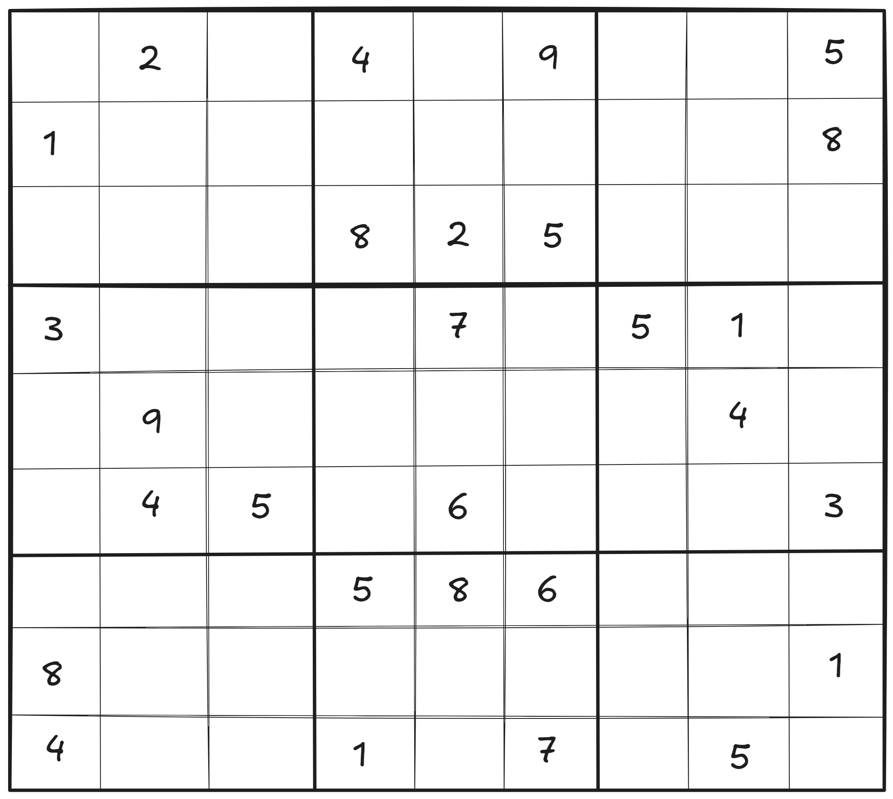

# 🧩The Sudoku Showdown🧩


✨🌟 Tips from your angel: My darlings✨😇, you are soooo smartttttt! 😍🙌 Take a break and enjoy your well-deserved rest while solving the problem!! 🛌🍹📚 Good luck!!! 🍀🎉💪


## **Game Rules**

Welcome to the **Sudoku Showdown**, my darlingggg! 🧠🔮 The aliens 👽 have hidden their final departure time ⏰ inside one of **nine Sudoku puzzles** 🧩. But beware—only **one of these puzzles** holds the true time, while the others are full of decoys 🚫❌.

Your mission is simple: **Solve the Sudoku puzzles**. Only the **correct puzzle** contains the **real departure time**, and inside that puzzle, you must focus on only **one sub-grid** to find the answer. The time hidden within the grid is **in 24h (e.g. 1212 is 12:12)**, but solving the full puzzle is the key 🔐.

## **Sudoku Puzzles** 🧩

Here are the **nine puzzles** to solve. You have been told the **correct** **Sudoku** to choose and the location of the correct sub-grid containing the correct time in [decrypt-the-alien-captains-log.md](decrypt-the-alien-captains-log.md "mention"). Each Sudoku puzzle follows standard rules: fill in the missing numbers so that every row, column, and 3x3 sub-grid contains the digits 1-9. Good luck, mortal! 🌟💪


Not all sudokus are solvable my darllinggg. Plz make sure u are solving the correct one using the captain's log in [#encrypted-message](decrypt-the-alien-captains-log.md#encrypted-message "mention").


### Sudoku 1

<figure><picture><source srcset="../.gitbook/assets/sudoku-1-dark.png" media="(prefers-color-scheme: dark)"></picture><figcaption>
sudoku 1
</figcaption></figure>

### **Sudoku 2**

<figure><picture><source srcset="../.gitbook/assets/sudoku-2-dark.png" media="(prefers-color-scheme: dark)"></picture><figcaption>
sudoku 2
</figcaption></figure>

### **Sudoku 3**

<figure><picture><source srcset="../.gitbook/assets/sudoku-3-dark.png" media="(prefers-color-scheme: dark)"></picture><figcaption></figcaption></figure>

### **Sudoku 4**

<figure><picture><source srcset="../.gitbook/assets/sudoku-4-dark.png" media="(prefers-color-scheme: dark)"></picture><figcaption>
sudoku 4
</figcaption></figure>

### **Sudoku 5**

<figure><picture><source srcset="../.gitbook/assets/sudoku-5-dark.png" media="(prefers-color-scheme: dark)"></picture><figcaption>
sudoku 5
</figcaption></figure>

### Sudoku 6

<figure><picture><source srcset="../.gitbook/assets/sudoku-6-dark.png" media="(prefers-color-scheme: dark)"></picture><figcaption>
sudoku 6
</figcaption></figure>

### Sudoku 7

<figure><picture><source srcset="../.gitbook/assets/sudoku-7-dark.png" media="(prefers-color-scheme: dark)"></picture><figcaption>
sudoku 7
</figcaption></figure>

### Sudoku 8

<figure><picture><source srcset="../.gitbook/assets/sudoku-8-dark.png" media="(prefers-color-scheme: dark)"></picture><figcaption>
sudoku 8
</figcaption></figure>

### Sudoku 9

<figure><picture><source srcset="../.gitbook/assets/sudoku-9-dark.png" media="(prefers-color-scheme: dark)"></picture><figcaption>
sudoku 9
</figcaption></figure>

**Good luck, my darling darlinggg!!!** 🌟 Your Happy Meal 🍔🍟 is almost in your grasp. Solve the Sudoku and find the **time hidden** before it’s too late! ⏳

Tips to find the exact time after u find the correct location of the sub-grid

There is no math here 🚫🔢, the answer is in this page already!!! 😮💡 Try with the "functions" that is embedded in the page!!! 🔍💻 If u still have no idea 🤔, ask your angel 👼 for more **hints!!! Good luck, my darlingggg!!!** 🍀💖✨

