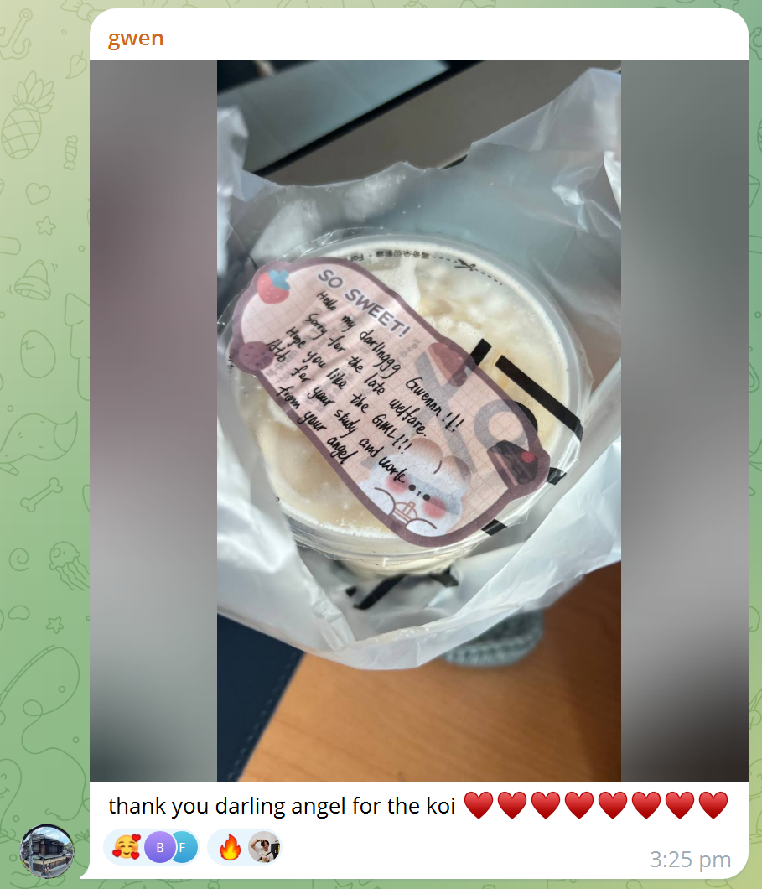
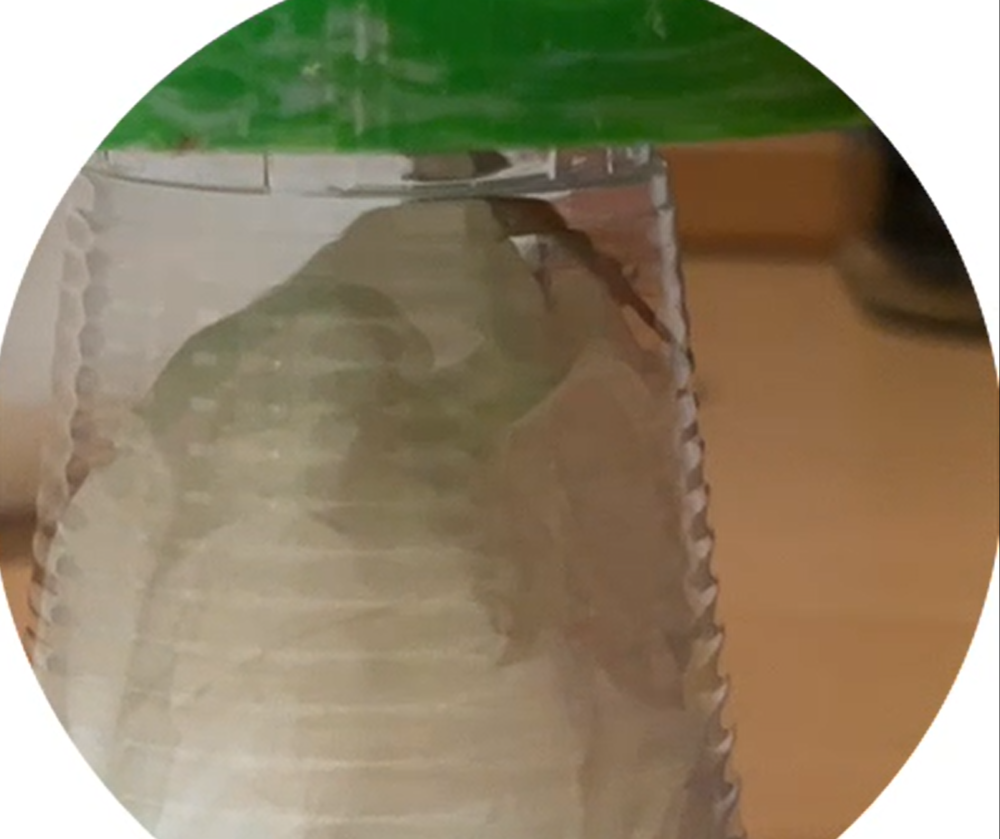
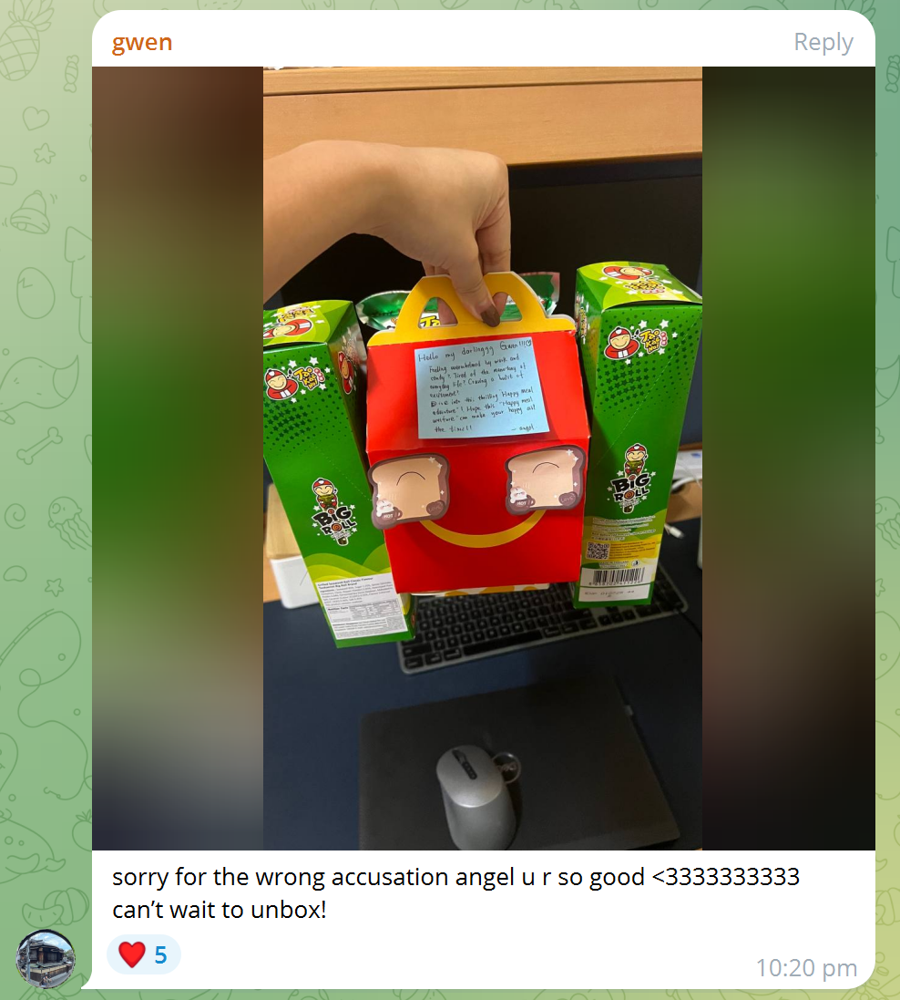
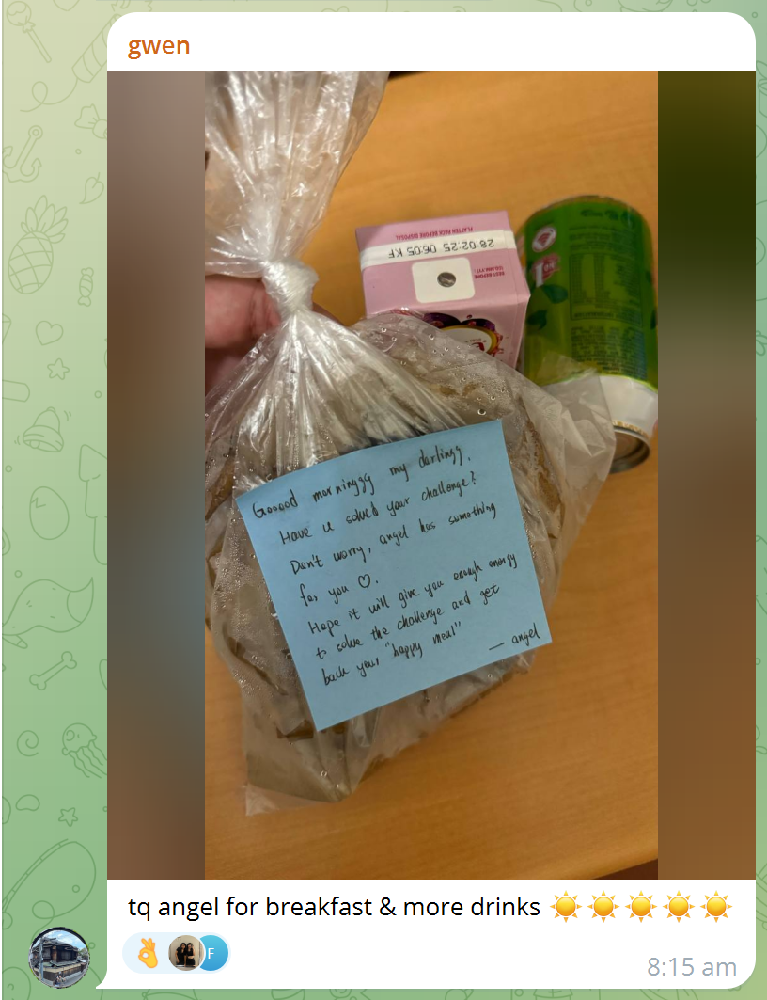
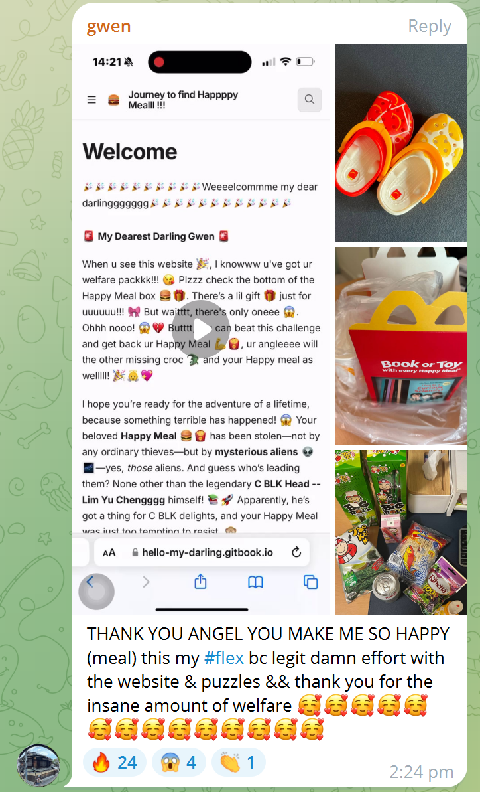
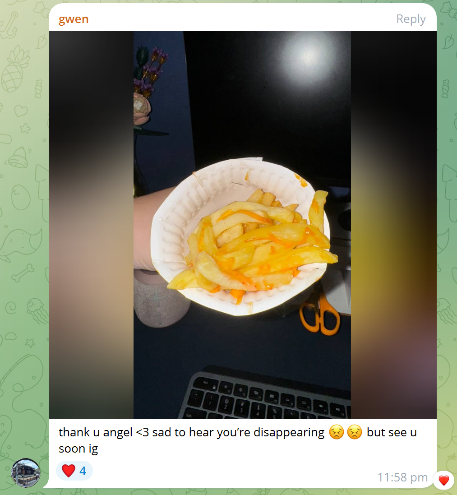
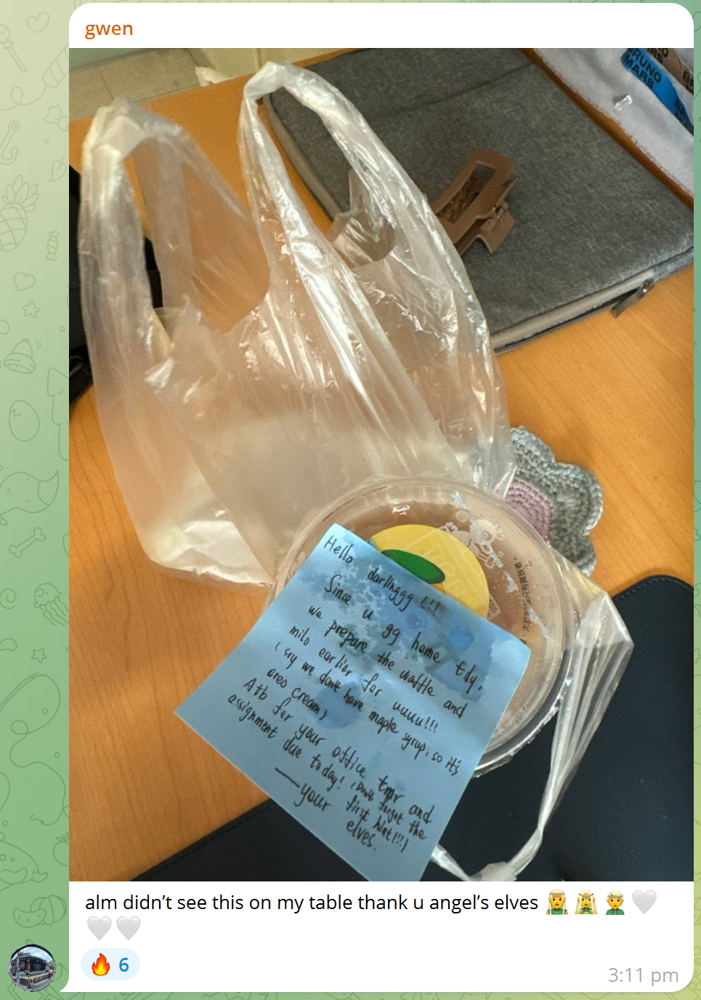
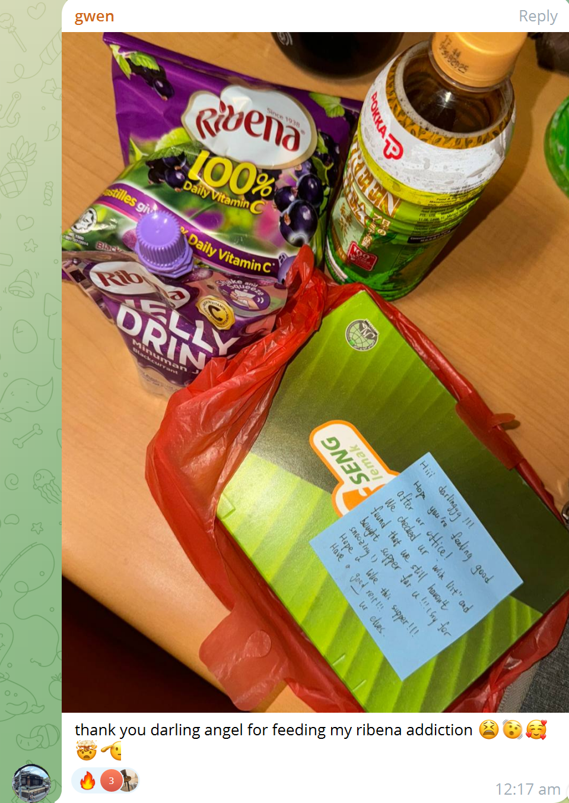
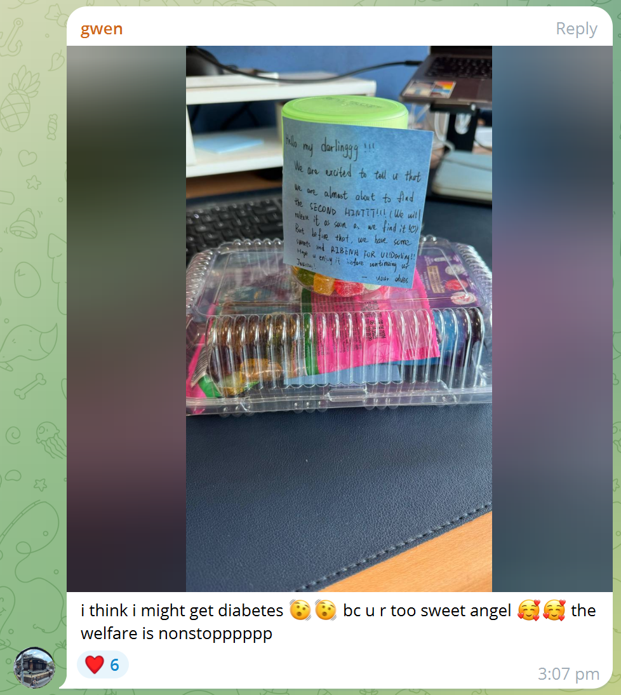
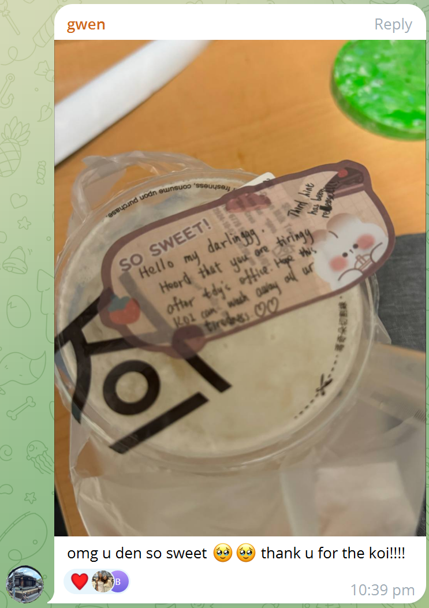

# 💖Thank u my darlingggggg💖

**To My Dearest Darlingggg** 💖,

**Congratulations** 🎉! You've almost made it through _**two**_ amazing journeys 🌟, and you’ve shown us once again that you’re **the best and the smartest** 💡! We couldn't be prouder of you 🥳.

As with all great adventures, every journey eventually evolves 🌱. While this may be the **last journey** where we, ur angel and ur elves, offer our hints and support 🧝‍♂️🧝‍♀️, it’s not a goodbye! Instead, we look forward to **cheering you on** from the sidelines 🥳, knowing you’ll continue to **shine** ✨.

And now, there’s **one more thing**... 😉✨

Just like in all the best Apple reveals 📱, we’ve saved something **special** for you! We want to take this moment to say a **massive THANK YOU** 🙏💖! Not only for all the **reverse welfare** you’ve given us 🤩🍫, but for your **endless understanding**, **patience**, and **thoughtfulness** 🫶. Your kindness and support inspire us to **design more challenges** and create even more fun surprises 🎁, all with one goal in mind: **to make you happy, my darlinggg** 💕!

You've been a **true star** ⭐ through every step of these journeys 🌍✨, and your joy motivates us to give our very best 💫.

So, before we wrap up this adventure 🎁, let’s take a little time to **look back** at all the fun we had 🛤️💫. From **the very first welfare** to the **final challenge** 🔍, it’s been an **unforgettable ride** 🎢!

## From ur Angelll

### 💖The very firrrrst welfareee💖

On **September 11th**, after some serious snoozing (sry my darlinggg 😅), your angel began this **amazing AnM** journey with you by gifting the **KOI GML**. Hahaha, I still remember how nervous I was! 😳 Knowing my darling has many things don’t like, I kept **asking and asking** (maybe a little too much 😆) to make sure it would be **just perfect** for my darlingggg. But seeing your smile made it all worth it 💕!

<figure><figcaption>
Firrrrst wellfaree
</figcaption></figure>

### 💖The seconddd welfare💖

Your angel still remembers the day (Sep 16th) when designing the **first journey**—the journey to find your **Happy Meal**—for my darlingggg 💖. Inspired by the delightful toys in McDonald's Happy Meal 🍟🎁 and your love for solving **Sudokus** 🧩, your angel wanted to combine these two things to make you **happyyy**!

However, something **unfortunate** happened during delivery 😱. Instead of the **thoughtfully crafted “rocket”** 🚀, someone mistakenly sent you a lizard! Ohhh noooo! 🦎 That's definitely not from your angel! Hahaha!

<figure><figcaption>
Lizarddd noooo
</figcaption></figure>

But fortunately, the **“rocket”**, which was left by the aliens (the first appearance of the elves! 🧝‍♂️✨), was successfully delivered to you my darling, containing **lots of welfare** to support my darling through your first **journey**! 🎉💫 My darling, your happiness means the world to us, and we’ll always be here to cheer you on! 🥳💕

<figure><figcaption>
Rockkeeet Let's goooo!
</figcaption></figure>


**Just one day** after your angel’s **second welfare** (on **September 17th** 🎉), your angel received the sweetest **reverse welfare** from my darlingggg! 😍 It’s the **KOI**!!! 🧋💖 Oh my goodness, your angel **loved it so much**! 💕✨

Seeing your thoughtful gesture filled my heart with joy 🌟, and it’s moments like these that make every journey even more special! Thank you, my darlingggg, for always being so sweet and amazing! 💫💖


### 💖The thirddd welfare💖

Just **two days** after the launch of the **first journey** (now it’s **September 18th**! 🎉), your angel knew that solving the puzzles and Sudokus could be a bit tricky 😅. To make sure my darlinggg could get back that **Happy Meal** 🍟❤️, your angel decided to **wake up early** 🌅 and bring you some delicious **waffles from CH** 🧇✨!

It’s all about cheering you on and making your journey a little sweeter! 🍯💖 You’re never alone in this, my darlinggg—your angel is here to support you every step of the way! 🥳💕

<figure><figcaption>
Waffle breakfast!!
</figcaption></figure>

### 💖The fourthhhhh welfare💖

**Another two days later**—it’s now **September 20th** 🎉—and my darlingggg has proven once again how **smart** you are! 💡✨ You’ve successfully completed the **first journey** to find the Happy Meal 🍟🎁, and now your angel is thrilled to give you the **real Happy Meal**! 🎊❤️

<figure><figcaption>
Happpy Meal! Yay!
</figcaption></figure>

Seeing you enjoy the journey and the Happy Meal made your angel’s heart so full 💖😭! As long as my darlingggg is **happy**, your angel is **happyyy** too! 💫🥳 Yayyy!!! 🎉💕

## From ur Elvessss

Unfortunatelyyy, as you already know, my darlinggg 💔, after the **Happy Meal Journey**, your angel **disappeared** due to Sauron’s dark magic, "mretdim" 🖤⚡. Butttt, fear not! The **elves** have stepped in to take over! 🧝‍♀️🧝‍♂️ We, the elves, are now here to make sure our darlinggg stays **happy** and supported! 💫💖


**Just three days** after the **Happy Meal** (Sep 23rd)🎁, my darlinggg still remembers your angel 🕊️ and gave yet another **reverse welfare**—**Awfully Chocolate**!!! 🍫😭💖 Ohhh, your angel absolutely **loved it**! 💕✨


Knowing how **keen** you are to uncover the identity of your angel 🕵️‍♀️, we, the elves, have decided to dive into our **ancient books** 📚✨ to search for every possible **hint** we can find for you! We will stop at nothing to help you solve the mystery! 🧝‍♂️🔍

### 💖The fifthhh welfare💖

We **kick-started** our journey on Oct 1st with the delicious **cheese fries** 🧀🍟 from **THeart** (yum!!! 😋) and the exciting release of the **first hint** [welcome-to-rivendell.md](../find-ur-angel/welcome-to-rivendell.md "mention")! 🔍✨ The adventure began with full hearts and happy tummies 💖🥳, ready to dive into the next chapter of our journey!

<figure><figcaption>
Cheeese Fries!
</figcaption></figure>

### 💖The sixthhh welfare💖

After making a little mistake on **Oct 2nd’s night** 😔, we forgot to cancel the order when we found out our darlinggg wouldn’t be in. To make up for our error, we decided to get even the **waffles earlier** 🧇🍯 for my darlinggg as a special treat! 💕 But, despite our best efforts—even though we flew with the **EAGLE** 🦅 to get them to you—by the time the waffles arrived, they were still a bit cold 🥶. So **sorry**, my darlinggg! 💖

We truly hope the warmth of our love made up for it 🫶💫!

<figure><figcaption>
Waffles and Milo
</figcaption></figure>

### 💖The seventhhh welfare💖

As we neared the **end of AnM** 🕊️, we wanted to make sure there was **nothing** our darlinggg still wished for that we hadn’t gotten yet. And then we realized—there was still the **chicken cutlet set**! 🍗🎉 So, of course, we had to get this **special meal** for our darlinggg 💖✨, hoping it would bring some extra joy and comfort.

We also wished for our darlinggg to **quickly recover** from all the tiredness of the office work 😴💼, and let this meal be a little boost of love and energy! 💕💪

<figure><figcaption>
Chicken cutlet set!
</figcaption></figure>

### 💖The eighth welfare💖

At the **end of the week** before the **AnM ending** (on **Oct 4th** 🎉), we made **big progress** in discovering clues about our darlinggg’s **angel**! 🕊️✨ We were so excited to share this with you that we prepared some **sweet treats** 🍬🍫 and released the **second hint**! 🔍💡

We also wanted to make sure our darlinggg had a **solid weekend** filled with rest and happiness 🛌💖, knowing that each step brings you closer to uncovering the angel’s identity! 🥳💕

<figure><figcaption>
Sweeeeets
</figcaption></figure>


On the **same dayyyy** 🎉, our darlinggg was **sooo niccceeee**! 💖 We received the most amazing **reverse welfare** againnn—**KOI**!!! 🧋✨ Ohhh, we loved it **sooo much**! 😍💕

It made us feel **incredibly grateful** and reminded us just how **kind and thoughtful** our darlinggg truly is! 💫 You always manage to brighten our day and fill our hearts with joy 💕🥰!


## 💖The second-lastttt welfare💖

It was **just yesterday** (on **Oct 7th**! ⏳), the day before the **AnM ending**. We knew time was running out 🕰️, so we hurried and gave it our **all** to find the **third hint**! 🧩💡 And guess what? **Yayyy, we got it!!!** 🎉✨

To share this special news with you, my darlinggg, we sent you the **KOI** again 🧋💖—the **exact same one** as [#the-very-firrrrst-welfareee](thank-u-my-darlingggggg.md#the-very-firrrrst-welfareee "mention")! It came with our **sincere hope** that “the end is always as good as the start!” 💫💖 We wanted this final chapter to be just as sweet and memorable as the beginning of our journey! 🌟✨

<figure><figcaption>
KOI again!
</figcaption></figure>

## Last but not least...

Tilll now, that's nearly all for our **recap** of this **amazing AnM journey** with my darlingggg! 🌟✨ Thank you so much for your **patience** in reading all the way to this line! 📖💖

We truly want to say a **massive thank you** to you, my darlinggg 🙏💕. Your **kindness**, **happiness**, and **thoughtfulness** have made us (your **angel** and **elves**) feel **sooo content** and **happyyy**! 💫🤗 Your understanding and patience throughout this journey have meant the world to us! 💖💖 Thank you, my darlinggg, again and again for being the **amazing person** you are! 💕💫

We are **sorry** that in some places, we didn’t do as well as we could have 😔. So so **sorry** for that, my darlinggg 💔.

In return for all your **kindness**, we (your **angel** and **elves**) have prepared a **special final gift** 🎁✨ just for **youuuuu**! You’ll find out what it is **after the revelation**!!! 🌟🎉

And now, it truly is the **end** of this journey! 🌈✨ We’re so **sorry** for writing so much, but we just wanted to express our **sincere gratitude** for you, my darlingggg! 💖🙏

We really look forward to **playing more** together in the future (especially learning **mahjong** from you! 🎉🀄️ Hahaha!) and sharing even more fun moments! 😄💕

While the **AnM journey** may be coming to a close, your **angel** and **elves** sincerely hope you carry this **passion**, **curiosity**, and **perseverance** into your future "journeys"! 🌟✨ May you discover **more happiness** in everyday life and be **happy all the time**! 🌻💖

**Thank you, darling, for everything!** You are truly **the best** 💕🌟!

\-- Your Angel and Elves
